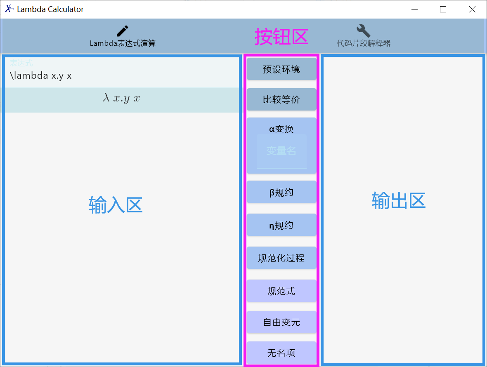
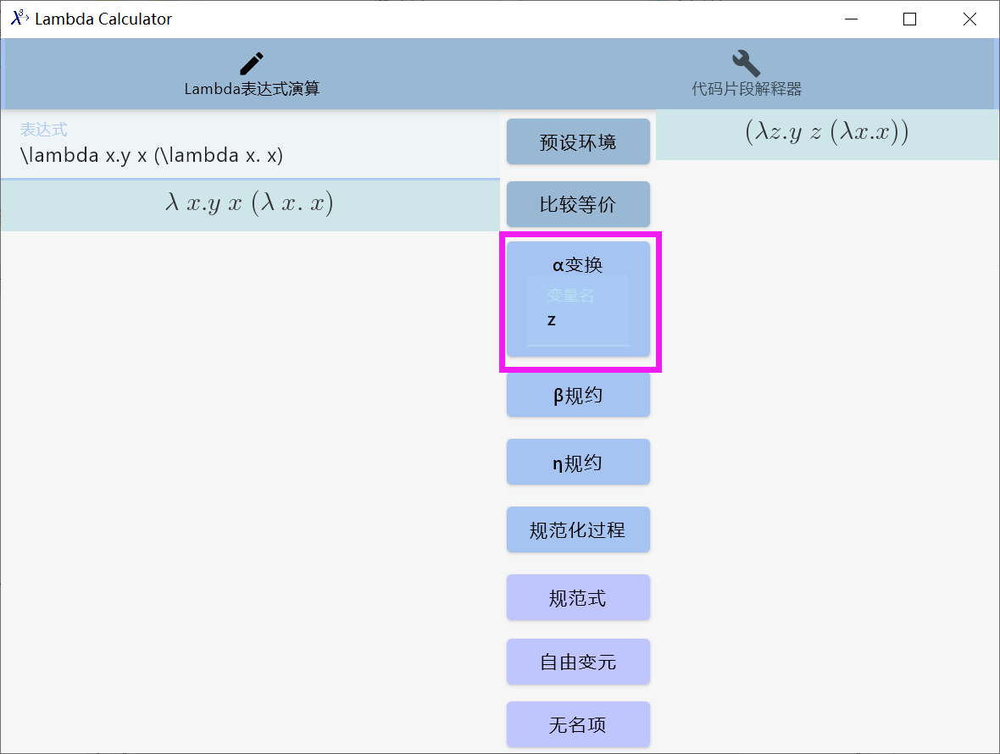
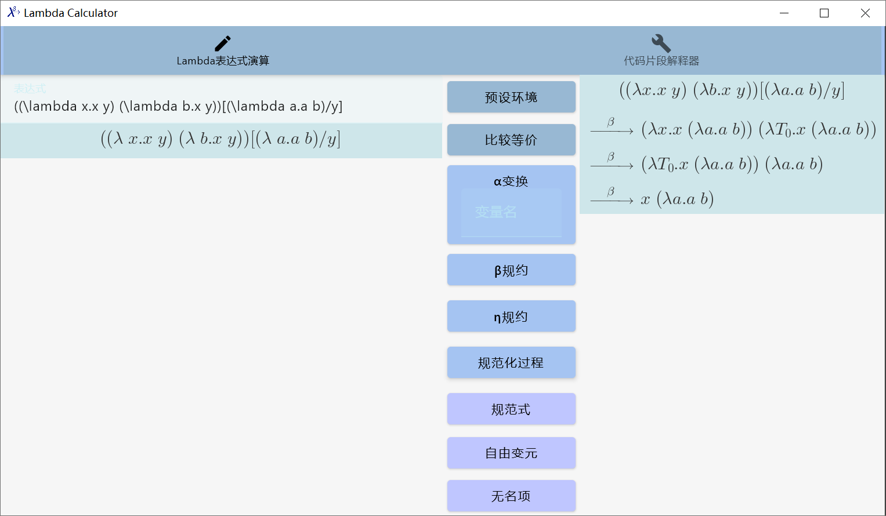
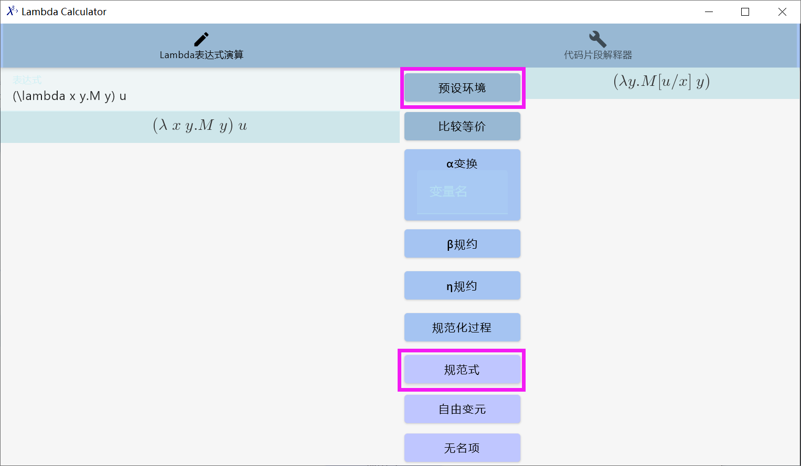
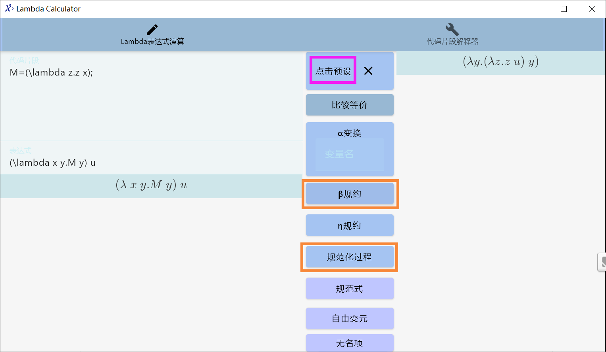
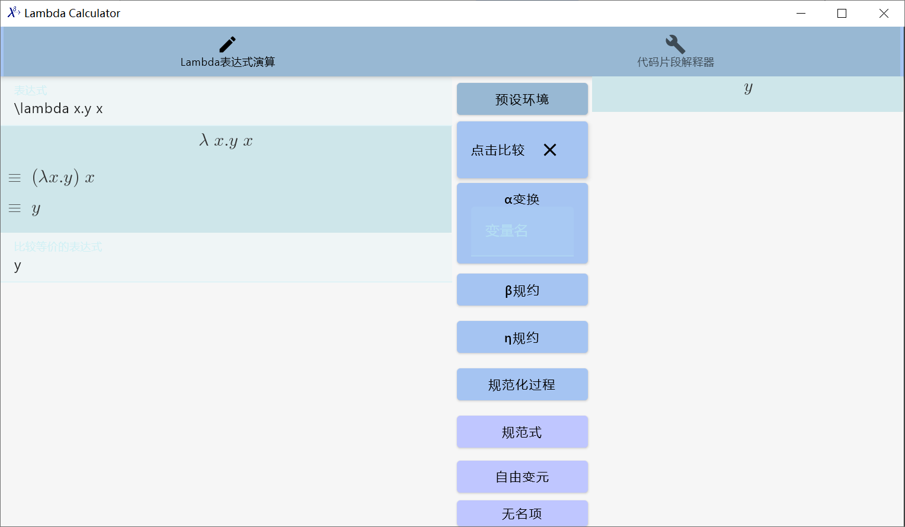

# Lambda Calculator—— λ演算器

- [Lambda Calculator—— λ演算器](#lambda-calculator-λ演算器)
  - [Lambda表达演算](#lambda表达演算)
    - [认识lambda表达式](#认识lambda表达式)
    - [基础的lambda演算操作](#基础的lambda演算操作)
      - [替换](#替换)
      - [α变换](#α变换)
      - [β规约](#β规约)
      - [η规约](#η规约)
    - [求规范式](#求规范式)
      - [求规范式](#求规范式-1)
      - [观察最左规约过程](#观察最左规约过程)
    - [其他的lambda演算操作](#其他的lambda演算操作)
      - [求自由变元](#求自由变元)
      - [求无名项](#求无名项)
    - [为操作预设环境](#为操作预设环境)
    - [与预设的表达式比较等价](#与预设的表达式比较等价)
    - [进阶：预设自然数系统进行运算](#进阶预设自然数系统进行运算)
      - [赋值表达式](#赋值表达式)
      - [替换表达式](#替换表达式)
      - [作用域表达式](#作用域表达式)
    - [内置的函子](#内置的函子)
      - [操作函子](#操作函子)
      - [指令函子](#指令函子)
      - [特殊函子](#特殊函子)
    - [自然数系统](#自然数系统)
    - [递归](#递归)

这是一个lambda演算的教学工具，通过引导的过程，掌握lambda演算的3种规约规则，了解基于lambda演算的算术系统、递归运算等相关规则。

安装完成后，可以在开始菜单中搜索lambda-calculator呼出应用，（需要安装[JDK17](https://www.oracle.com/java/technologies/downloads/#java17)）。

工具分为两个主要模块，Lambda表达演算与代码片段解释。

## Lambda表达演算



演算器界面分为3个区域：

- 输出区：在这里可以输入要进行操作的lambda表达式
- 输出区：这里输出操作之后的情况
- 按钮区：这里显示的是进行操作的几种按钮

### 认识lambda表达式

- 使用`\lambda` 或者`λ`来开始一个lambda抽象式/lambda函数定义
- 使用` `空格来分隔开两个不同的变量，以组合两个表达式，也就是形成lambda施用式

在演算器中，输入`\lambda x.y x`来观察演算器的变化情况。值得一提的是，演算器采用的代码格式是$L^AT_EX$格式。

在演算器中，对于自由变元来说，大写字母引出的单词表示某一个表达式，而小写字母引出的单词表示不可分割的字符串（当是自由变元时，默认当成不含约束变元内容）。

### 基础的lambda演算操作

#### 替换

`E[n/x]`表示，使用n替换在E中的x。

在演算器中：

- 输入`(\lambda y.x)[n/x]`，点击【β规约】，观察输出的情况。
- 输入`(\lambda y.x)[(\lambda x.x x)/x]`，点击【β规约】，观察输出的情况。

#### α变换

在演算器中：

- 输入`\lambda x.y x`，在【α变换】下方输入`z`，观察输出的情况。
- 输入`\lambda x.y x (\lambda x. x)`，在【α变换】下方输入`z`，观察输出的情况，思考为什么(λ x.x)子表达式中的`x`没有被替换。



#### β规约

在演算器中：

- 输入`(\lambda x. x y x) z`，点击【β规约】，观察输出情况。
- 输入`(\lambda x. (\lambda y. (\lambda z. x y z))) a b c`，点击【β规约】，观察输出情况。

#### η规约

在演算器中：

- 输入`\lambda x.y x`，点击【η规约】，观察输出情况。
- 输入`(\lambda x.y) x`，点击【η规约】，观察输出情况。

### 求规范式

#### 求规范式

在演算器中：

- 输入`(\lambda x. (\lambda y. (\lambda z. x y z))) a b c`，点击【规范式】，观察输出情况。
- 输入`((\lambda x.x y) (\lambda b.x y))[(\lambda a.a b)/y]`，点击【规范式】，观察输出情况。

#### 观察最左规约过程

上述操作后，点击【规范化过程】，观察输出情况。



### 其他的lambda演算操作

#### 求自由变元

在演算器中：

- 输入`\lambda x.y x`，点击【自由变元】，观察输出的情况。
- 输入`\lambda x.y x (\lambda x. x)`，点击【自由变元】，观察输出的情况。

#### 求无名项

### 为操作预设环境

在演算器中：

- 输入`(\lambda x y.M y) u`，点击【规范式】，观察输出的情况。
- 点击【预设环境】，在出现的文本框中输入`M=(\lambda z.z x);`，点击【点击预设】；
- 点击【β规约】，观察一步输出的情况。
- 点击【规范式】，观察输出的情况。
- 点击【点击预设】旁边的【X】，清空预设环境。





### 与预设的表达式比较等价

在演算器中：

- 输入`\lambda x.y x`，点击【η规约】，观察输出的情况。
- 点击【比较等价】；
- 在出现的文本框中，输入`(\lambda x.y) x`，点击【点击比较】，观察输出的情况。
- 在出现的文本框中，输入`y`，点击【点击比较】，观察输出的情况。
- 点击【点击比较】旁边的【X】，清空预设环境。



### 进阶：预设自然数系统进行运算

在演算器中：

- 点击【预设环境】，在出现的文本框中输入:

- ```lambda
  ZERO = (\lambda f x. x);
  SUCC = (\lambda n f x. f (n f x));
  PEANO ( I | ZERO | SUCC );
  ```

- 在输入框中输入`I_{0}`，点击【规范化过程】，观察输出的情况。

- 在输入框中输入`I_{1}`，点击【规范化过程】，观察输出的情况。

- 在输入框中输入`I_{2}`，点击【规范化过程】，观察输出的情况。

- 点击【比较等价】；

- 在出现的文本框中，输入`SUCC I_{1};`，点击【点击比较】，观察输出的情况。

- 在出现的文本框中，输入`SUCC (SUCC I_{0});`，点击【点击比较】，观察输出的情况。

## 代码片段解释

### 语法说明

#### lambda表达式

- 使用`\lambda` 或者`λ`来开始一个lambda抽象式/lambda函数定义

- 使用` `空格来分隔开两个不同的变量，以组合两个表达式，也就是形成lambda施用式


一个lambda表达式是完整的一句，句末加分号`;`

注释是`#`开头，`#`后要加一个空格才视为注释

```lambda
# Abstraction Lambda Expression
\lambda x.y x;

# Applied Lambda Expression
(\lambda x y.M y) u;
```

对于自由变元来说，大写字母引出的单词表示某一个表达式，而小写字母引出的单词表示不可分割的字符串（当是自由变元时，默认当成不含约束变元内容）。

对于lambda抽象式，组合时需要加`()`括号

#### 赋值表达式

新添加了赋值语法，可以用来代替一段表达式

```lambda
test=(\lambda x.x);
(\lambda x y.x test) u;
```

#### 替换表达式

支持替换语法，如`E[(\lambda x.x)/x]`

#### 作用域表达式

表达式增加了作用域语法，用大括号`{}`引出一个作用域。作用域中的单元为一句，以分号隔开。可以在作用域中进行赋值等操作。

大括号`{}`返回值是最后一个表达式。

```lambda
\lambda x.{
    msg = (\lambda x.y);
    PRINT (\lambda y.y);
};
```

### 内置的函子

内置的函子分为了操作函子、指令函子和特殊函子。

#### 操作函子

操作函子是lambda演算的基本操作。写入代码时，如果要看操作的运行情况，可以使用`ACT`执行表达式内的各种操作函子，查看执行的效果。

```lambda
ACT (BETA ((\lambda x.y x) u));
```

| 操作函子                | 参数                                         | 效果  |
| :---------------------- | -------------------------------------------- | ----- |
| 'BETA' 或'\\beta'或'β'  | 表达式                                       | β规约 |
| 'ALPHA'或'\\alpha'或'α' | 抽象式 替换的变量名                          | α代换 |
| 'ETA'或'\\eta'或'η'     | 抽象式                                       | η规约 |
| 'REPLACE'               | 表达式 替换前的变量名 替换后的表达式的变量名 | 替换  |

#### 指令函子

指令函子是在解释阶段就执行的函子，一般用于向控制台输出某些内容。如下代码可以输出表达式的规范形式。

```lambda
NORMALIZE ((\lambda x y.x (\lambda x.x)) u );
```

| 指令函子           | 参数                          | 效果                                     |
| :----------------- | ----------------------------- | ---------------------------------------- |
| 'ACT'              | 表达式                        | 执行表达式内的各种函子的操作             |
| 'FV'               | 表达式                        | 输出自由变元集合                         |
| 'PRINT'            | 表达式                        | 输出表达式                               |
| 'NORMALIZE'        | 表达式                        | 输出规范形式                             |
| 'DISPLAY'          | 表达式                        | 输出最左规约的规约过程                   |
| 'EQUIV'或'\\equiv' | 表达式 要比较的表达式的变量名 | 输出当前表达式和要比较的表达式的等价情况 |
| 'REMOVE_NAME'      | 表达式                        | 输出对应无名项                           |
| 'PEANO'            |                               | 见下一节                                 |

**发散型表达式无法规约**

使用`NORMALIZE`和`DISPLAY`可以对表达式进行规约，输出规约过程和结果。但是对于发散型表达式来说，无法完成规约。

```lambda
omega = ((\lambda x.x x) (\lambda x.x x));
NORMALIZE omega; # 栈溢出错误
```

**无名项 De Bruijn's Index**

使用`REMOVE_NAME`作为函子，可以输出表达式的无名项。

```lambda
test1 = (\lambda x.\lambda y.x (y x));
REMOVE_NAME test1;

test2 = (\lambda z.(\lambda y.y (\lambda x.x)) (\lambda x.z x));
REMOVE_NAME test2;
```

#### 特殊函子

| 特殊函子           | 参数                          | 效果                                                         |
| :----------------- | ----------------------------- | ------------------------------------------------------------ |
| 'FIX'              | `λthis.`开头的表达式          | Y组合子，组合一个表达式变成新的表达式<br />(λ g. ((λ x. g (x x)) ((λ x. g (x x))) |
| 'EQUIV'或'\\equiv' | 表达式 要比较的表达式的变量名 | 输入两个参数，输出当前表达式和要比较的表达式的等价情况，并转为<br />True=(λ f x. f); False=(λ f x. x); |


多个参数的函子作用时，可以使用一个括号，内部`|`分隔开；也可以用空格隔开多个参数（'PEANO'不可以），也就是柯里化的效果。

其他的一些代码例子：

```lambda

NORMALIZE (((\lambda x.x y) (\lambda b.x y))[(\lambda a.a b)/y]);
DISPLAY ((\lambda y.y ((\lambda a.x a) (\lambda a.a))) (\lambda b.b));

ACT (ALPHA ((\lambda x.(z (\lambda y.x))) | y));
# 与上面的效果相同
ACT (ALPHA (\lambda x.(z (\lambda y.x))) y);     
ACT (REPLACE ((\lambda x .x y) | y | k));

msg = (\lambda y.y);
EQUIV ( (\lambda x.x) | msg );
```
### 自然数系统

解释器还提供了皮亚诺自然数系统支持。

需要事先准备两个lambda表达式，分别为初始元`ZERO`和后继函数 `SUCC`，通过`PEANO ( 变量名 | ZERO | SUCC )` 定义一个皮亚诺自然数系统，如下：

```lambda
ZERO = (\lambda f x. x);
SUCC = (\lambda n f x. f (n f x));
PEANO ( I | ZERO | SUCC );
PRINT (I_{0});
PRINT (I_{1});
```

定义好以后，可以使用`I_{n}` （n为大于等于0的数）来索引到系统内的数。

其他函子测试可以[参考](http://jwodder.freeshell.org/lambda.html)

```lambda
ZERO = (\lambda f x. x);
SUCC = (\lambda n f x. f (n f x));
PEANO ( I | ZERO | SUCC );

# I_{1} = (\lambda f x. f x);
# I_{2} = (\lambda f x. f (f x));

PLUS = (\lambda m n f x. n f (m f x));
# EQUIV ((\lambda m n. n SUCC m)| PLUS );

PRED = (\lambda n f x. n (\lambda g h. h (g f)) (\lambda u. x) (\lambda u. u));
SUB = (\lambda m n. n PRED m);

MULT = (\lambda m n f. m (n f));
# EQUIV ((\lambda m n. m (PLUS n) I_{0} )|MULT);

Y = (\lambda g. (\lambda x. g (x x)) (\lambda x. g (x x)));
EXP = (\lambda a b. b a);

# logical
TRUE = (\lambda f x. f);
FALSE = (\lambda f x. x);
EQUIV ( I_{0} | FALSE );

AND = (\lambda f x. f x f);
OR = (\lambda f x. f f x);
NOT = (\lambda n f x. n x f);
XOR = (\lambda f x. f (NOT x) x);
# EQUIV ( (\lambda f. f FALSE TRUE) | NOT );

# comparison

ISZERO = (\lambda n. n (\lambda x. FALSE) TRUE);
LEQ = (\lambda m n. ISZERO (SUB m n));
LT = (\lambda a b. NOT (LEQ b a));
EQ = (\lambda m n. AND (LEQ m n) (LEQ n m));
NEQ = (\lambda a b. OR (NOT (LEQ a b)) (NOT (LEQ b a)));
GEQ = (\lambda a b. LEQ b a);
GT = (\lambda a b. NOT (LEQ a b));
```

可供测试的例子

```lambda
and1 = (AND TRUE FALSE); EQUIV (FALSE| and1);
and2 = (AND FALSE FALSE); EQUIV (FALSE| and2);
not1 = (NOT TRUE); EQUIV (FALSE | not1);
xor1 = (XOR (OR TRUE FALSE) FALSE); EQUIV (TRUE | xor1);

lessThan = (LT I_{0} I_{1}); EQUIV (TRUE | lessThan);
moreThan = (GT I_{4} I_{3}); EQUIV (TRUE | moreThan);
```

### 递归

使用Y组合子函子`FIX`来代替原先的Y组合子lambda表达式形式。

使用方式：`FUNC1 = (FIX (λ this.表达式1));`。`FUNC1`的参数个数就是表达式1的参数个数，在表达式1中，使用前面定义的`this`来表示函数的递归调用。

例如阶乘函数如下：
$$
fact(n) = 
\left \{
\begin{array}{ll}
    1,     & x\equiv0\\
    n \times fact(n-1),                                & otherwise
\end{array}
\right.
$$
转为lambda表达式即为：

```
FACT = (FIX (λ this.λ n. 
	ISZERO n     # 这是一个函数，输出结果为True=(λ f x. f); False=(λ f x. x);
		I_{1} 
		(MULT n (this (SUB n I_{1})))
));
```

完整的代码如下：

```lambda
# 预先需要设置的内容
ZERO = (\lambda f x. x);
SUCC = (\lambda n f x. f (n f x));
PEANO ( I | ZERO | SUCC );
PRED = (\lambda n f x. n (\lambda g h. h (g f)) (\lambda u. x) (\lambda u. u));
SUB = (\lambda m n. n PRED m);
MULT = (\lambda m n f. m (n f));
TRUE = (\lambda f x. f);
FALSE = (\lambda f x. x);
ISZERO = (\lambda n. n (\lambda x. FALSE) TRUE);

# 由Y组合子结合的阶乘递归形式
FACT = (FIX (\lambda this.\lambda n. ISZERO n I_{1} (MULT n (this (SUB n I_{1})))));

NORMALIZE (FACT I_{0});
NORMALIZE (FACT I_{1});
NORMALIZE (FACT I_{2});
DISPLAY (FACT I_{3});
```

